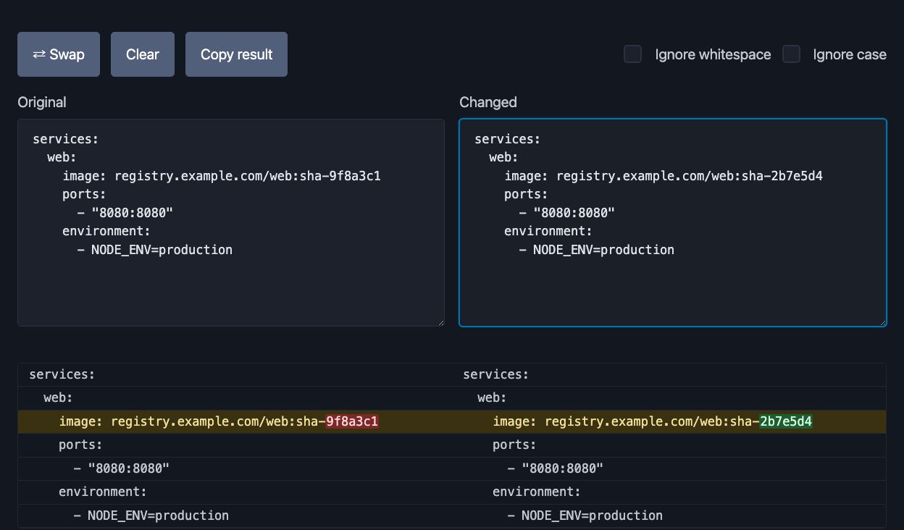

# Diffraction

[](./LICENSE)
[](https://maccuaa.github.io/diffraction/)

A fast, client-side tool for comparing two blocks of text or code and highlighting their differences. No server, no build step, no data ever leaves your browser.

**[Try it live](https://maccuaa.github.io/diffraction/)**



## Features

- Live, side-by-side diffing as you type
- Character-level highlighting within changed lines (e.g. spot exactly which part of a docker-compose image SHA changed)
- Ignore-whitespace and ignore-case toggles
- Swap, Clear, and Copy-result actions
- Works entirely client-side — nothing is uploaded anywhere

## How it works

Plain HTML, CSS, and ES modules — no bundler, no framework, no build step. GitHub Pages serves this repo's `main` branch directly, so there's no separate deploy pipeline either.

## Running locally

This project has no build step. Serve the directory with any static file server and open it in a browser:

```bash
npx serve .
# or
python3 -m http.server
```

## Running tests

The core diff logic is unit tested with Node's built-in test runner:

```bash
npm install
npm test
```

## Project docs

- [`CONTEXT.md`](./CONTEXT.md) — domain glossary
- [`docs/adr/`](./docs/adr/) — architecture decision records

## License

[MIT](./LICENSE)
